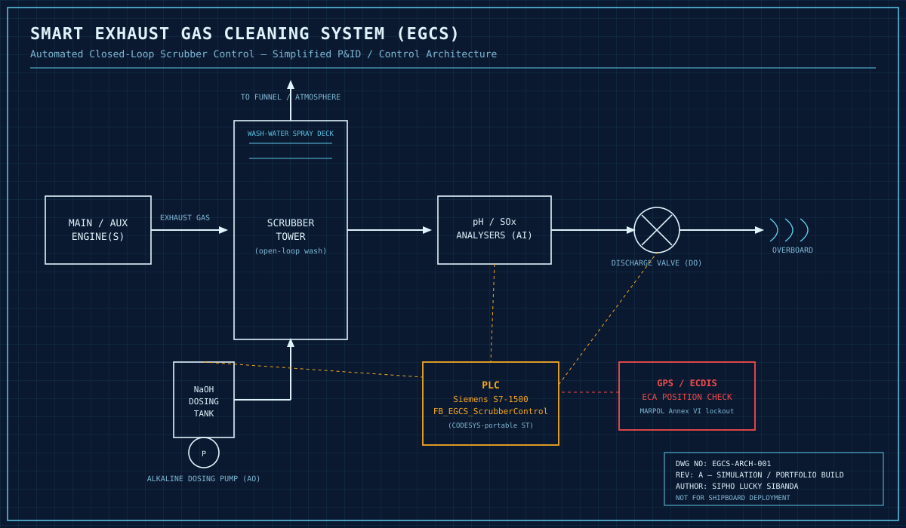

# ⚓ Smart Exhaust Gas Cleaning System (EGCS)
## 🚀 Live Project

### 🖥️ Interactive HMI

🚢 **[Launch the Interactive EGCS Scrubber HMI](https://hangmanlucky.github.io/marine-egcs-scrubber-control/)**

A browser-based Engine Control Room simulation with live process values, alarms, dosing control, discharge-valve logic and simulated ECA lockout behaviour.


### Automated Closed-Loop Scrubber Control for Marine Emissions Compliance


**Author:** Sipho Lucky Sibanda

---

## 🌍 Marine Context — Why This Matters

International shipping is bound by **MARPOL Annex VI**, which caps exhaust sulphur
emissions at 0.50% m/m globally and 0.10% m/m inside **Emission Control Areas (ECAs)**
such as the Baltic, North Sea, and North American coastlines. Rather than burning
expensive low-sulphur fuel everywhere, many vessels install an **Exhaust Gas Cleaning
System (scrubber)**: seawater or alkaline-dosed wash water strips SOx out of the
exhaust before it reaches the funnel.

The catch is that the *wash water itself* becomes regulated — its pH and SOx-loading
must stay within IMO limits before it can be discharged overboard, and discharge is
often banned outright inside ECAs and port limits. That means the automation isn't
just "run a pump" — it's a **closed-loop control + regulatory interlock problem**,
which is exactly what this project simulates.

## 🔧 What This Project Does

`FB_EGCS_ScrubberControl` is a PLC function block (IEC 61131-3 Structured Text) that:

- Runs a **PID control loop** to modulate an alkaline (NaOH) dosing pump so discharge
  water pH stays at or above the IMO MEPC.259(68) minimum of **6.5**
- Monitors exhaust **SOx concentration (ppm)** against a compliance threshold
- **Locks the overboard discharge valve** the instant a GPS/ECDIS feed reports the
  vessel has entered an Emission Control Area — regardless of how compliant the
  water chemistry is
- Fails to a safe state (pump off, valve closed) on any sensor/comms fault
- Logs pH, SOx, dosing rate, and discharge status on a rolling basis for MARPOL
  Annex VI record-keeping

## 🖥️ HMI — Engine Control Room View

The `hmi/index.html` mockup simulates the operator-facing screen you'd find in the
Engine Control Room or on a bridge repeater: live pH/SOx/temperature gauges, dosing
pump output, discharge valve state, a simplified process schematic, and an alarm/event
log. It also **simulates the vessel periodically entering an ECA** so you can see the
discharge lockout banner trigger live — open it in any browser.


> A rendered screenshot is already included at `images/hmi-dashboard.png`. The HMI
> itself is fully live — open `hmi/index.html` in any browser to watch the gauges
> drift and see the vessel automatically cycle in and out of an ECA (every ~14s),
> triggering the discharge lockout banner. Feel free to grab your own capture during
> that lockout moment for an even more striking recruiter-facing screenshot.

## 🗺️ System Architecture



Exhaust flows from the main/auxiliary engine into the scrubber tower, where wash
water strips out SOx. The wash water is checked by pH/SOx analysers, the PLC adjusts
the alkaline dosing pump accordingly, and the discharge valve only opens when the
water is compliant **and** the vessel is outside an ECA (per the GPS/ECDIS interlock).

## ⚙️ Key Engineering Concepts

| Concept | How it's implemented |
|---|---|
| Closed-loop PID control | `FB_PID` instance adjusting dosing pump speed 0–100% from live pH deviation |
| Regulatory interlock | Hard software lockout of the discharge valve while `GPS_InECA = TRUE` |
| Fail-safe design | Sensor/comms fault forces pump to 0% and valve closed within one scan |
| Hard trips vs. soft alarms | `pH_LowLow` forces 100% dosing instantly; `Alarm_LowpH` is a soft compliance warning |
| Regulatory data logging | Rolling `EmissionLog` array capturing pH/SOx/dose/discharge state every 60s |

## 📁 Repository Structure

```
marine-egcs-scrubber-control/
├── README.md
├── src/
│   └── EGCS_ScrubberControl.st       # IEC 61131-3 Structured Text PLC logic
├── docs/
│   ├── IO_List.md                    # Full I/O list with tags & addresses
│   └── Testing_Procedures.md         # FAT-style functional test cases
├── hmi/
│   └── index.html                    # Simulated Engine Control Room HMI
└── images/
    ├── architecture_diagram.svg      # P&ID / control architecture diagram
    └── hmi-dashboard.png             # (add your own screenshot here)
```

## 📄 Documentation

- [I/O List](docs/IO_List.md)
- [Functional Test Procedures](docs/Testing_Procedures.md)
- [Full Technical Manual (PDF)](ebook/EGCS_Technical_Manual.pdf) — 29-page project ebook covering regulatory context, architecture, hardware, control philosophy, full annotated code, HMI design, alarm philosophy, testing/commissioning, and a HAZOP-style hazard register

## 🧪 Running / Reviewing This Project

1. **PLC logic** — open `src/EGCS_ScrubberControl.st` in TIA Portal (SCL) or a
   CODESYS project, or simply read it: it's fully commented.
2. **HMI mockup** — open `hmi/index.html` directly in any browser. No build step,
   no dependencies.
3. **Test cases** — walk through `docs/Testing_Procedures.md`; each row maps to a
   forceable input scenario you can replicate in PLCSIM or a soft-PLC harness.

## ⚠️ Disclaimer

This is a **simulation and portfolio project**, built to demonstrate PLC logic,
regulatory-driven control design, and HMI/UX skill for automation and marine
engineering roles. It is not certified, has not been tested against real hardware,
and must not be used as a basis for an actual shipboard EGCS installation.

## 👤 Author

**Sipho Lucky Sibanda**
Automation & Controls Portfolio — Marine, Industrial & Applied Systems

---
